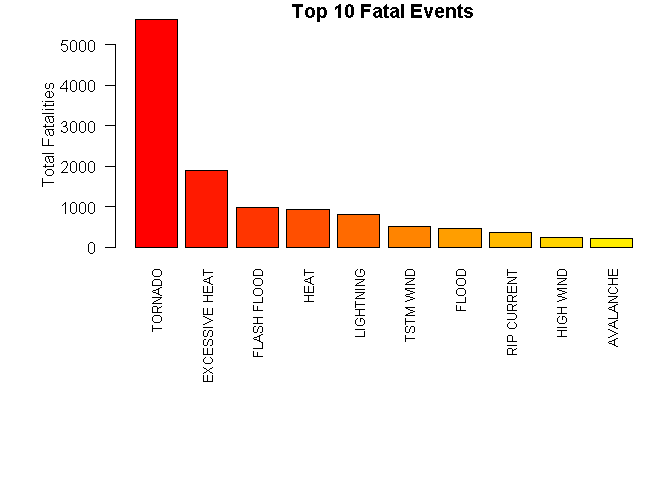
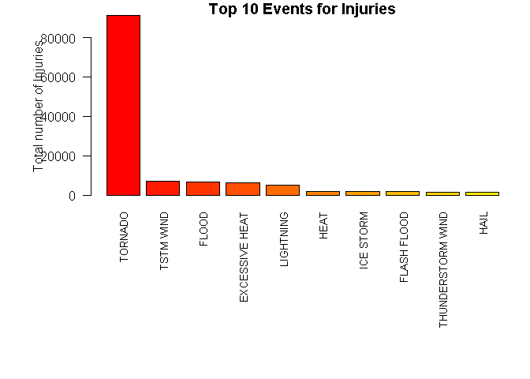
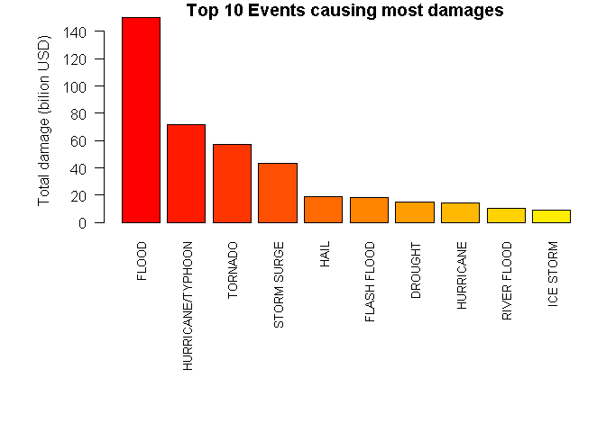

# Reproducible Research: Peer Assessment 2

# Synopsis

Storms and other severe weather events can cause both public health and economic problems for communities and municipalities. Many severe events can result in fatalities, injuries, and property damage, and preventing such outcomes to the extent possible is a key concern.

This project involves exploring the U.S. National Oceanic and Atmospheric Administration's (NOAA) storm database. This database tracks characteristics of major storms and weather events in the United States, including when and where they occur, as well as estimates of any fatalities, injuries, and property damage.

## Data Processing

### Setting up the Variables


```r
rm(list = ls())
```


```r
setwd("C:/Users/nnayar/Documents/Personal/Working Directory/Rep_Research_Assignment2")
```


```r
library(knitr)
```

```
## Warning: package 'knitr' was built under R version 3.2.4
```

```r
library(markdown)
```

```
## Warning: package 'markdown' was built under R version 3.2.5
```

```r
library(lattice)
```

### Downloading the data file


```r
filename <- "StormData.csv.bz2"
fileurl<-"https://d396qusza40orc.cloudfront.net/repdata%2Fdata%2FStormData.csv.bz2"

if(!file.exists(filename)){
        download.file(fileurl, filename, mode = "wb")
}

if(!file.exists("StormData.csv.bz2")){
        unzip(filename)
}
```

### Analysis

In this section we will be loading the data in the appropriate variables and converting the Event Names to upper case.


```r
data <- read.csv("StormData.csv.bz2",  strip.white = TRUE, stringsAsFactors = FALSE, sep = ",")
data$EVTYPE = toupper(data$EVTYPE)
data$YEAR <- as.numeric(format(as.Date(data$BGN_DATE, format = "%m/%d/%Y %H:%M:%S"), "%Y"))

head(data)
```

```
##   STATE__           BGN_DATE BGN_TIME TIME_ZONE COUNTY COUNTYNAME STATE
## 1       1  4/18/1950 0:00:00     0130       CST     97     MOBILE    AL
## 2       1  4/18/1950 0:00:00     0145       CST      3    BALDWIN    AL
## 3       1  2/20/1951 0:00:00     1600       CST     57    FAYETTE    AL
## 4       1   6/8/1951 0:00:00     0900       CST     89    MADISON    AL
## 5       1 11/15/1951 0:00:00     1500       CST     43    CULLMAN    AL
## 6       1 11/15/1951 0:00:00     2000       CST     77 LAUDERDALE    AL
##    EVTYPE BGN_RANGE BGN_AZI BGN_LOCATI END_DATE END_TIME COUNTY_END
## 1 TORNADO         0                                               0
## 2 TORNADO         0                                               0
## 3 TORNADO         0                                               0
## 4 TORNADO         0                                               0
## 5 TORNADO         0                                               0
## 6 TORNADO         0                                               0
##   COUNTYENDN END_RANGE END_AZI END_LOCATI LENGTH WIDTH F MAG FATALITIES
## 1         NA         0                      14.0   100 3   0          0
## 2         NA         0                       2.0   150 2   0          0
## 3         NA         0                       0.1   123 2   0          0
## 4         NA         0                       0.0   100 2   0          0
## 5         NA         0                       0.0   150 2   0          0
## 6         NA         0                       1.5   177 2   0          0
##   INJURIES PROPDMG PROPDMGEXP CROPDMG CROPDMGEXP WFO STATEOFFIC ZONENAMES
## 1       15    25.0          K       0                                    
## 2        0     2.5          K       0                                    
## 3        2    25.0          K       0                                    
## 4        2     2.5          K       0                                    
## 5        2     2.5          K       0                                    
## 6        6     2.5          K       0                                    
##   LATITUDE LONGITUDE LATITUDE_E LONGITUDE_ REMARKS REFNUM YEAR
## 1     3040      8812       3051       8806              1 1950
## 2     3042      8755          0          0              2 1950
## 3     3340      8742          0          0              3 1951
## 4     3458      8626          0          0              4 1951
## 5     3412      8642          0          0              5 1951
## 6     3450      8748          0          0              6 1951
```

We don't need all the columns from the original data set so we will remove the columns that are not required


```r
dataanalysis <- data[,c("STATE", "EVTYPE", "FATALITIES", "INJURIES", "PROPDMG", "PROPDMGEXP","CROPDMG", "CROPDMGEXP","YEAR" )]
```


## Results

### Types of events that are most fatal

We will find the events that caused most of the fatalities. Subsequently we will build a histogram showing the number of fatalities for the top 10 events.


```r
fatal <- aggregate (FATALITIES~EVTYPE, dataanalysis, sum)
fatal <- fatal [order(fatal$FATALITIES, decreasing=TRUE),]
par(mar=c(12, 6, 1, 1))
barplot (height = fatal$FATALITIES[1:10], names.arg = fatal$EVTYPE[1:10], las = 2, cex.names= 0.8,
         col = rainbow (30, start=0, end=0.5))
title (main = "Top 10 Fatal Events")
title (ylab = "Total Fatalities")
```



### Types of events that caused the most injuries

We will find the events that caused most of the injuries. Subsequently we will build a histogram showing the number of injuries for the top 10 events.


```r
injury <- aggregate (INJURIES~EVTYPE, dataanalysis, sum)
injury <- injury [order(injury$INJURIES, decreasing=TRUE),]
par(mar=c(12, 6, 1, 1))
barplot (height = injury$INJURIES[1:10], names.arg = injury$EVTYPE[1:10], las = 2, cex.names = 0.8,
         col = rainbow (30, start=0, end=0.5))
title (main = "Top 10 Events for Injuries")
title (ylab = "Total number of Injuries")
```



### Economic Damages

We will find the total economic damage produced by each type of event, to evaluate those that caused the largest costs.Property and crop damages will be summed-up. Subsequently we will build a histogram for the top 10 events.


```r
symbol <- c("", "+", "-", "?", 0:9, "h", "H", "k", "K", "m", "M", "b", "B");
factor <- c(rep(0,4), 0:9, 2, 2, 3, 3, 6, 6, 9, 9)
multiplier <- data.frame (symbol, factor)

dataanalysis$damage.prop <- dataanalysis$PROPDMG*10^multiplier[match(dataanalysis$PROPDMGEXP,multiplier$symbol),2]
dataanalysis$damage.crop <- dataanalysis$CROPDMG*10^multiplier[match(dataanalysis$CROPDMGEXP,multiplier$symbol),2]
dataanalysis$damage <- dataanalysis$damage.prop + dataanalysis$damage.crop

damage <- aggregate (damage~EVTYPE, dataanalysis, sum);
damage$bilion <- damage$damage / 1e9;
damage <- damage [order(damage$bilion, decreasing=TRUE),]

par(mar=c(12, 6, 1, 1))
barplot (height = damage$bilion[1:10], names.arg = damage$EVTYPE[1:10], las = 2, cex.names = 0.8,
         col = rainbow (30, start=0, end=0.5))
title ("Top 10 Events causing most damages")
title (ylab = "Total damage (bilion USD)")
```



## Conclusions

1. The most fatal event is "TORNADO"
2. "TORNADO" also causes the most injuries
3. "FLOOD" is the event that causes the most economic damage.
